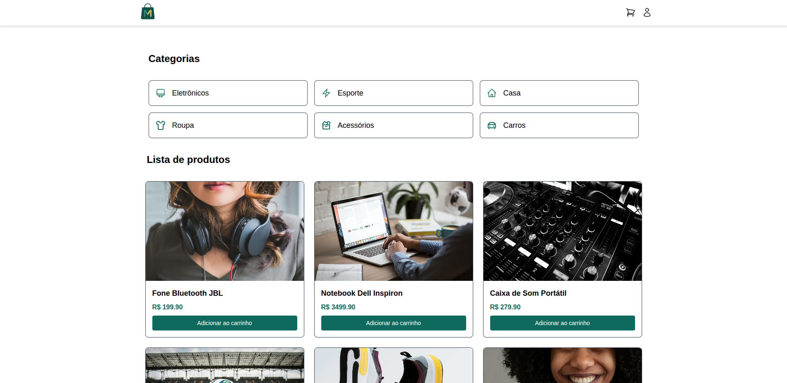
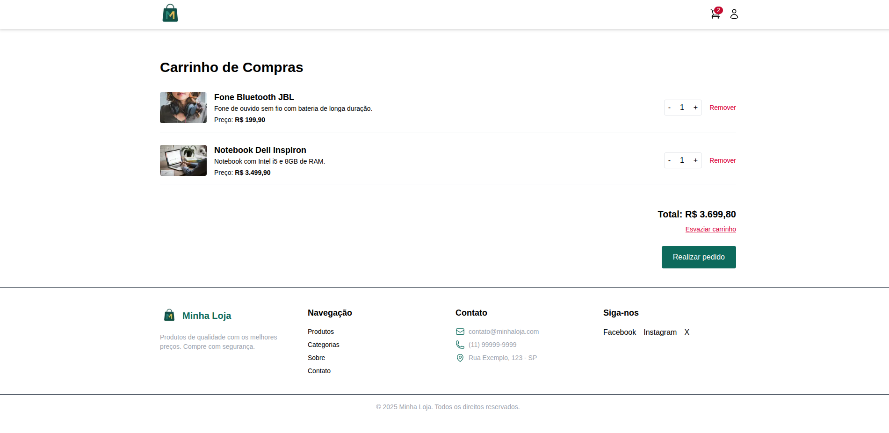
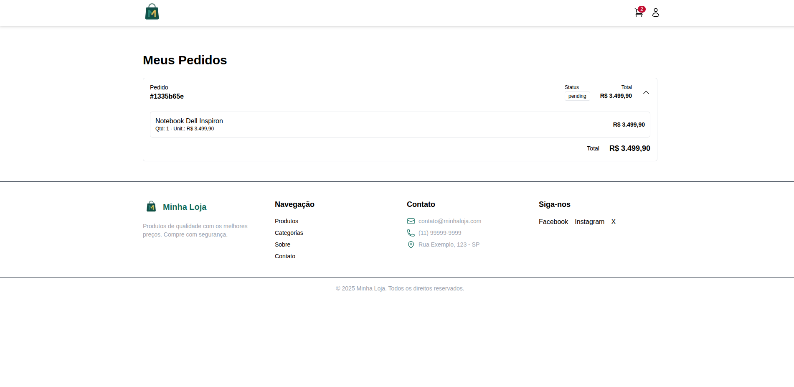
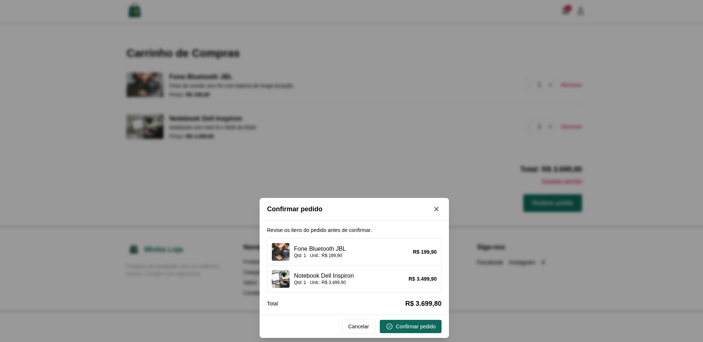

# STG Catalog Challenge

## 📌 Descrição

O **STG Catalog Challenge** é um sistema completo de e-commerce desenvolvido como desafio técnico para a STG Company.  
O projeto possui autenticação de usuários, catálogo de produtos, carrinho de compras e integração com WhatsApp para finalização do pedido.  
O objetivo é demonstrar habilidades em **Next.js, TypeScript, Tailwind CSS e Supabase**, seguindo boas práticas de código e UI/UX.

---

## 🚀 Tecnologias Utilizadas

- **Next.js** - Framework React para construção do frontend e rotas
- **TypeScript** - Tipagem estática para maior segurança e escalabilidade
- **Tailwind CSS** - Estilização rápida e responsiva
- **Supabase** - Autenticação e banco de dados PostgreSQL
- **Heroicons** - Ícones para UI
- **Lucide React** - Ícones adicionais
- **Pexels/Unsplash** - Imagens para os produtos

---

## 🛠️ Como Rodar Localmente

```bash
# 1️⃣ Clone o repositório
git clone https://github.com/EversonDoNascimento/stg-catalog-challenge.git

# 2️⃣ Acesse a pasta do projeto
cd stg-catalog-challenge

# 3️⃣ Instale as dependências
npm install

# 4️⃣ Configure as variáveis de ambiente
# Crie o arquivo .env e adicione:
NEXT_PUBLIC_SUPABASE_URL=
NEXT_PUBLIC_SUPABASE_ANON_KEY=

# 5️⃣ Rode o projeto em ambiente de desenvolvimento
npm run dev

# 6️⃣ Acesse no navegador
http://localhost:3000
```

---

## 🤖 Uso de Inteligência Artificial

Foi utilizada a **IA ChatGPT** para:

- Gerar componentes de interface em React/Next.js
- Criar funções para autenticação e proteção de rotas
- Gerar scripts SQL para criação e inserção de dados no banco
- Sugerir melhorias de UI/UX
- Revisar e otimizar código existente

---

## 🔗 Links

<!-- - **GitHub**: [https://github.com/usuario/stg-catalog-challenge](https://github.com/usuario/stg-catalog-challenge) -->

- **Deploy (Vercel)**: [https://stg-catalog-challenge-swart.vercel.app/](https://stg-catalog-challenge-swart.vercel.app/)

---

## ✅ Checklist de Funcionalidades

### Autenticação

- ✅ Login com e-mail/senha
- ✅ Registro de novos usuários
- ✅ Proteção de rotas
- ✅ Logout funcional

### Catálogo

- ✅ Grid responsivo com +12 produtos
- ✅ Busca/filtro por nome
- ✅ Visualização detalhada do produto
- ✅ Adicionar ao carrinho

### Carrinho

- ✅ Lista de produtos
- ✅ Editar quantidades
- ✅ Finalizar via WhatsApp

### Integração com WhatsApp

- ✅ Geração automática da mensagem formatada
- ✅ Link wa.me
- ✅ Limpar carrinho após envio

---





